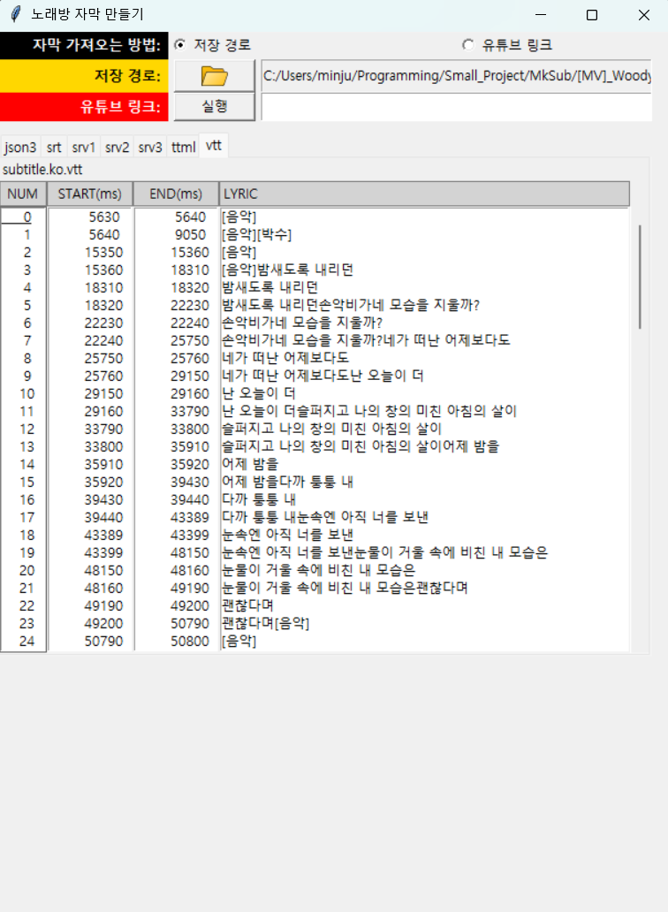

# 자막 생성 프로그램(CreateCaption)
> 노래 동영상의 노래방 자막을 생성합니다.

## 제작 동기
> 예전에 취미로 수화를 배우며 교회 농인부에서 유튜브 찬송가의 자막을 만든 적이 있는데 원하는 노래는 많지만 일일이 수작업으로 자막을 만들기 쉽지 않아서 자동으로 노래방 자막을 만들어주는 프로그램을 개발하게 되었습니다.

- 자막과 노래방 자막의 차이점
    - 자막: 문장 단위로 끊어서 동영상에 자막을 띄웁니다.
    - 노래방 자막: 노래에 맞춰서 한글자씩 자막을 띄웁니다.

## 개발 현황
**2026.06.11** : mkSub.py 개발 내용

- 라디오 버튼으로 자막 가져오는 방법 설정
    - 저장 경로
        - 경로 내 오디오 파일 조회(확장자: mp3, wav ,m4a ,ogg ,wma)
        - 오디오 파일 없을 시, 비디오 파일 조회(확장자: mp4, avi, mov, mkv, wmv, flv, webm, ogv, gif)
            - 조회한 비디오 파일에서 오디오 추출하여 mp3로 
        - 자막 파일 조회(확장자: json3, srt, srv1, srv2, srv3, ttml, vtt)
    - 유튜브 링크
        - 유튜브 링크로 유튜브 정보, 자막, 오디오 다운로드
- 자막 파일 분석
    - 전에 분석한 자막 파일 정보 파일(sub_dict.json) 존재 할 시 가져오기
- GUI 개발
  - 자막 가져오는 방법, 저장 경로, 유튜브 링크 받기
  - 분석한 자막 파일 별로 tab 만들어서 listbox에 줄번호, 시작 시간, 종료
    시간, 가사 띄우기
  - 4개의 리스트 박스 연동
    - 리스트 박스 원소 선택: 한 리스트 박스의 원소를 선택할 시, 다른 리스트 박스의 같은 인덱스 원소도 선택됨
    - 스크롤 연동 with 스크롤바: 네 개의 리스트 박스, 스크롤 바가 동시에 움직이도록 함.

---
### 이후 개발 계획
- 자막 편집 버튼 생성
- 자막 편집 알고리즘 개발

    

## 참고 자료
- [AI 자막 생성 및 번역 코드편 by parkhongf (Tistory 2025.02.27.)](https://parkhongf.tistory.com/entry/AI-%EC%9E%90%EB%A7%89-%EC%83%9D%EC%84%B1-%EB%B0%8F-%EB%B2%88%EC%97%AD-%EC%BD%94%EB%93%9C%ED%8E%B8#google_vignette)

- [Transcribe and Translate with OpenAI Whisper - Colab](https://colab.research.google.com/drive/1WLYoBvA3YNKQ0X2lC9udUOmjK7rZgAwr?usp=sharing)
